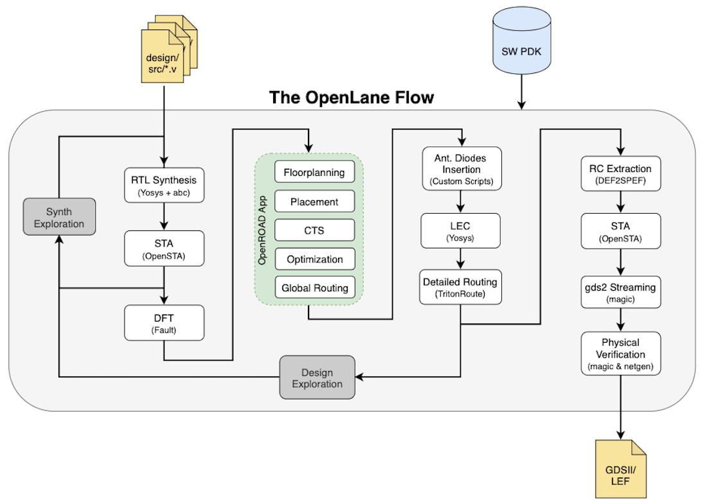
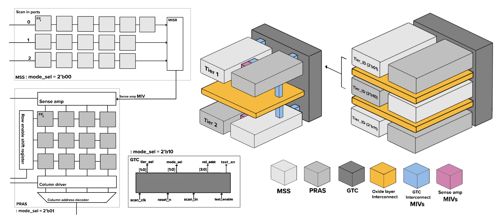
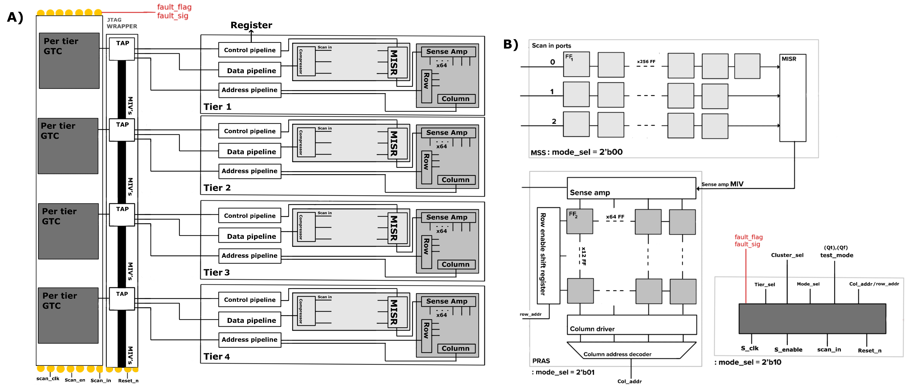
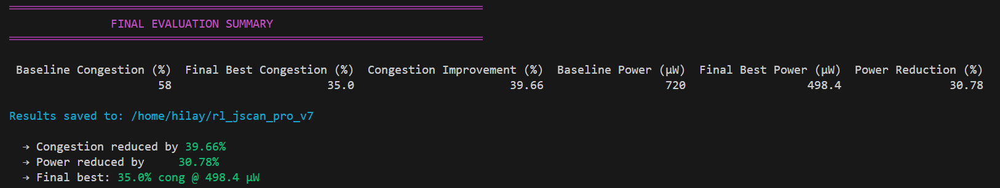
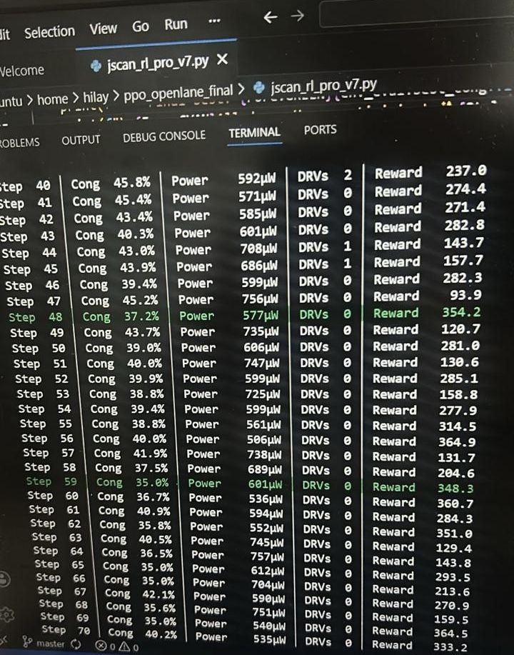

# Monolithic 3D JSCAN Architecture for 3-Tier IC Testing


**Complete RTL-to-GDS Monolithic 3D Joint Scan Architecture (JSCAN) with PPO Reinforcement Learning for ultra-low routing congestion and power optimisation.**

## ✨ Project Highlights

- **3-Tier Monolithic 3D JSCAN** with SAS, RAS, and scan modes
- Global Test Controller (GTC) dynamically cycles tiers, modes, columns
- Per-tier MISR for fault signature aggregation → single `fault_flag`
- Full OpenLane flow on **Sky130A** PDK (DRC/LVS clean)
- **PPO RL agent** automatically tunes density, die area, core utilization & routing adjustments
- **Up to 39.66% reduction** in maximum routing congestion vs default flow

## 📁 Repository Structure
```text
Monolithic-3D-JSCAN-Architecture-IC/
├── RTL/                          # All Verilog RTL files
│   ├── JSCAN_TOP.v               # Top-level 3-tier integration
│   ├── TIER_BLOCK.v              # Per-tier block (SAS + RAS + TSV)
│   ├── GTC.v                     # Global Test Controller
│   ├── MSS.v                     # Multi-bit Scan Chain (SAS mode)
│   ├── PRAS.v                    # Pseudo-Random Access Scan
│   ├── LC.v                      # Layer Connections
│   ├── MISR.v                    # Multiple Input Signature Register
│   └── JSCAN_TB.v                # Testbench with corner cases
├── ASIC_FLOW/                    # OpenLane results & final outputs
│   └── reports/                  # Congestion, timing, DRC reports
├── IMAGES/                       # Images
├── RL/                           # Reinforcement Learning MODELs 
├── 3D_JSCAN_V2                   # Contains results from Cadence
└── README.md
```
## 🏗️ Openlane flow 



## 🏗️ Proposed Architecture

**3-Tier Monolithic 3D JSCAN**
- Each tier contains: MSS (Serial), PRAS (Random Access), LC 
- Global Test Controller orchestrates all modes
- Built-in MISR on every tier
- Supports at-speed testing with shift/capture control
  



## ✨ Results



## Ubuntu
### 1. Setup Design
```bash
cd ~/ppo_openlane_final
source ~/openlane-venv/bin/activate
python jscan_rl_pro_v7.py
```
Final GDS: ~/OpenLane/designs/top_3d_jscan/runs/rl_low_congestion_jscan/results/final/top_3d_jscan.gds
